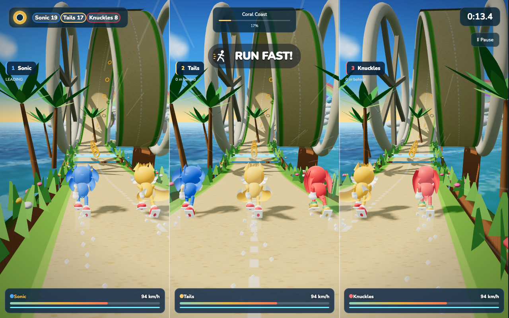
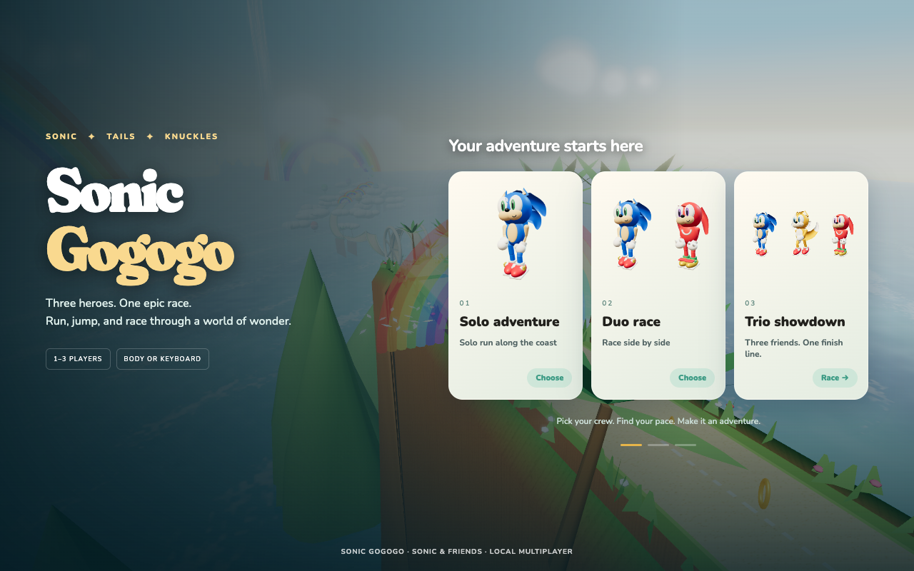
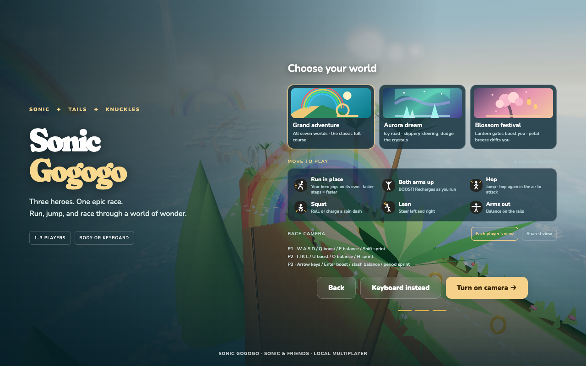
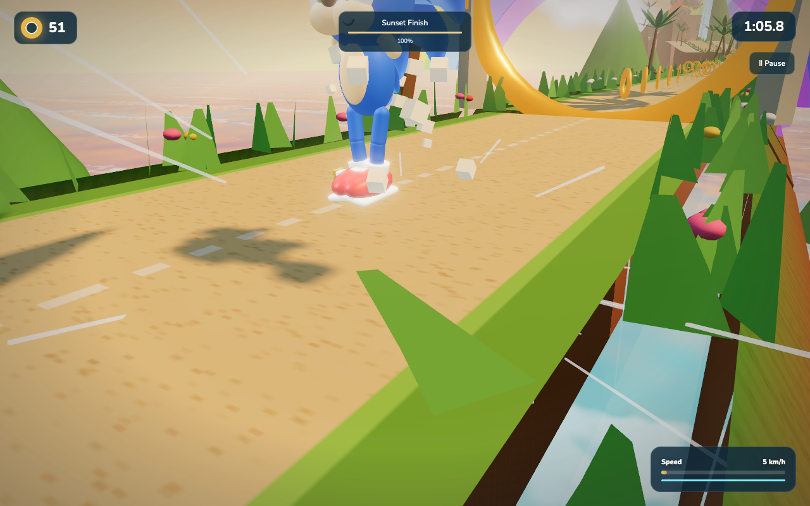
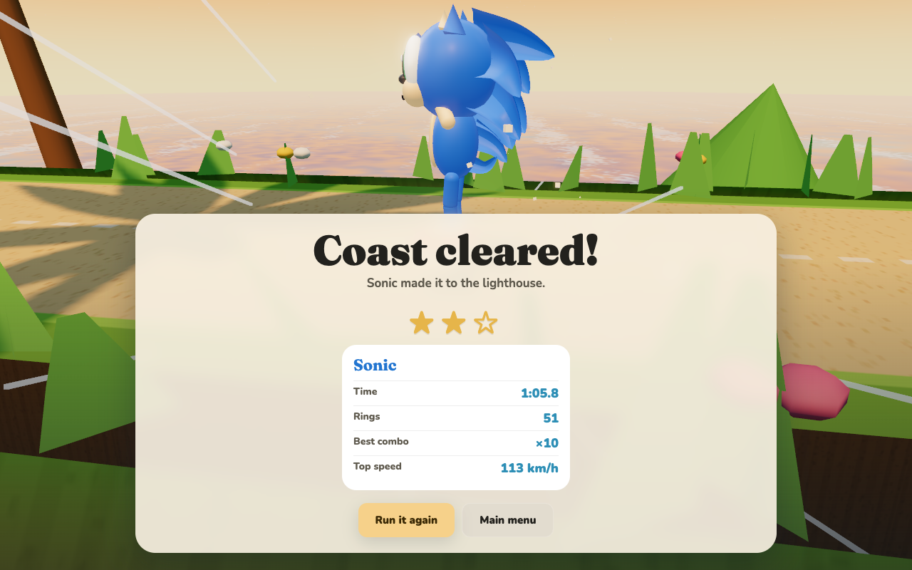

# Sonic Gogogo

A browser racing game for one, two, or three players — controlled by your **body**. Run in place in front of your webcam and your hero runs; hop, squat, and lean to jump, roll, and steer. No installs, no controllers, no accounts. Keyboard play is supported too.

**Play it: [sonic-gogogo.vercel.app](https://sonic-gogogo.vercel.app)**



## Screenshots

| | |
|---|---|
|  Pick solo, duo, or trio |  Three worlds, each with its own challenges |
|  Cross the line and celebrate |  Score overlays the celebration |

## How it works

The game runs [MediaPipe Pose](https://developers.google.com/mediapipe) in the browser to track up to three people standing side by side in one webcam frame. All processing happens locally on your machine — no video or pose data ever leaves the browser.

Body signals (knee lift, ankle alternation, torso bounce, arm pumping) feed an adaptive peak detector that measures each player's running cadence, normalized to torso length so it works at any distance from the camera. Each racer responds only to their own body: there is no catch-up rubber-banding, and every racer gets to finish.

### Moves

| Move | Effect |
|---|---|
| Run in place | Your hero speeds up — faster steps, faster hero |
| Hop | Jump; hop again mid-air for a homing attack |
| Squat | Roll through obstacles, or charge a spin dash from a standstill |
| Lean left / right | Steer |
| Arms straight out | Balance on the sky rails |
| Both arms up | Boost (recharges as you run), or glide from a big jump |

### Keyboard fallback

| Player | Steer | Jump | Squat | Boost | Balance | Sprint |
|---|---|---|---|---|---|---|
| P1 | A / D | W or Space | S | Q | E | Shift |
| P2 | J / L | I | K | U | O | H |
| P3 | Arrows | Up | Down | Enter | / | . |

Escape pauses. When using the camera, raise both arms to resume or to run again from the results screen.

## Worlds

Each world is a genuinely different race, not just a palette swap:

- **Grand adventure** — the classic course through all seven zones: coral coast, rainbow sky rails, a giant loop and corkscrew, jungle ruins, a collapsing bridge, a space run, and a sunset sprint to the lighthouse.
- **Aurora dream** — an icy road with slippery steering, crystal hazards you must jump or roll through, crystal-slalom ring lines, extra drone patrols, falling snow, and a slower dreamy soundtrack.
- **Blossom festival** — lantern gates that grant a glow boost, a petal breeze that drifts the racers, petal ring arcs, extra dash pads to keep the pace up, drifting petals, and a faster festival soundtrack.

## Getting started

```sh
npm install
npm run build
npm run serve
```

Open http://localhost:5173. Camera play needs a well-lit room with your shoulders, hips, and ideally knees in frame. Once every player is spotted, the race starts by itself.

## Testing

```sh
npm test
```

The suite builds the game, then drives six full headless run-throughs of the course with a scripted bot (no browser or GPU needed): solo sprint, two- and three-player keyboard races, a slow-jog run that proves the big jumps stay clearable, and three-player body-input races through both alternate worlds. Assertions cover race completion, finite physics state, independent per-player input, sticky pose identities when detections reorder or drop out, pause-timer correctness, and that a faster body pace always finishes ahead of a slower one. See [QA.md](QA.md) for details.

## Project structure

```
src/            Source, concatenated in numeric order into public/index.html
  1_head.html   Menu, HUD, camera setup, results — all UI and styles
  2_core.js     Pose tracking, cadence detection, gestures, keyboard, procedural audio
  3_world.js    Track spline builder, road geometry, renderer, sky and ocean
  4_zones.js    Zone atmospheres and the two alternate-world variants
  5_chars.js    Procedural character rigs, animation, live menu portraits
  6_game.js     Physics, collectibles, race flow, cameras, celebration
tools/
  build.mjs     Concatenates src/ into public/index.html and syntax-checks it
  simulate.mjs  Headless course simulation used by npm test
public/         The built site — a single self-contained HTML file
```

There is no bundler and no framework: the build is a file concatenation, and the whole game ships as one HTML file. Three.js and MediaPipe load from CDNs. Music and sound effects are synthesized at runtime with the Web Audio API — there are no audio assets.

## Deploying

The repo is set up for [Vercel](https://vercel.com): `vercel.json` builds with `npm run build`, serves `public/`, and sets the headers camera access requires. Any static host works — just serve the `public/` directory over HTTPS (`getUserMedia` requires a secure context).

## License

Code is [MIT](LICENSE) © 2026 Feifei Qiu.

This is a non-commercial fan project. Sonic, Tails, and Knuckles are trademarks of SEGA; the low-poly character likenesses here are fan art, are not covered by the MIT license, and this project is not affiliated with or endorsed by SEGA.
